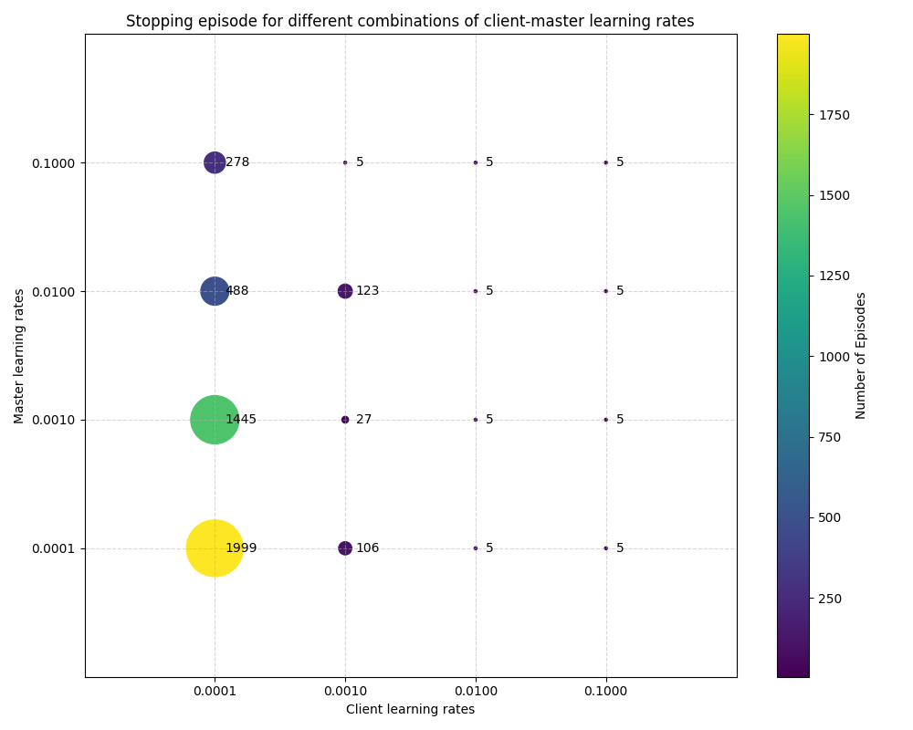

# Asymmetric Gradient Flow in Multi-Agent Actor-Critic Architectures

[](paper/main.tex)
[](LICENSE)

## Overview

This repository contains the research paper, experimental code, and analysis tools for investigating **asymmetric gradient flow and learning rate sensitivity** in Client-Master Multi-Agent Actor-Critic architectures.

### Key Finding

Client agents (actors) in MADRL stop updating their neural network weights at different episode numbers depending on learning rate configurations, while the master agent (critic) continues learning until training completion. **Tanh output saturation** is identified as the primary mechanism causing this premature actor convergence.

| Learning Rate | Stopping Episode | Converged? |
|--------------|------------------|------------|
| Actor=0.1, Critic=any | ~5 episodes | No |
| Actor=0.01, Critic=any | ~5 episodes | No |
| Actor=0.0001, Critic=0.001 | >2000 episodes | **Yes** |

## Repository Structure

```
gradient_asymmetry/
├── README.md                 # This file
├── requirements.txt          # Python dependencies
│
├── paper/                    # LaTeX paper
│   ├── main.tex             # Main paper file
│   ├── references.bib       # Bibliography
│   ├── sections/            # Paper sections
│   │   ├── introduction.tex
│   │   ├── related_work.tex
│   │   ├── background.tex
│   │   ├── methodology.tex
│   │   ├── analysis.tex
│   │   ├── discussion.tex
│   │   └── conclusion.tex
│   └── figures/             # Paper figures
│       ├── plot_num_episodes.png      # Figure 5.3: Stopping episodes
│       ├── plot_until_stop.png        # Performance at stopping
│       ├── plot_until_end.png         # Performance at end
│       ├── plot_at_training.png       # Training performance
│       └── AtEval_*.png / AtTraining_*.png  # Learning rate comparisons
│
├── experiments/              # Experimental code
│   ├── run_experiment.py    # Main experiment runner
│   ├── CCM_MADRL_with_tracking.py  # Modified CCM_MADRL with tracking
│   │
│   ├── gradient_tracking/   # Gradient magnitude analysis
│   │   └── gradient_tracker.py
│   │
│   ├── preactivation_analysis/  # Tanh saturation analysis
│   │   └── preactivation_tracker.py
│   │
│   └── results/             # Experiment outputs (generated)
│
└── data/                    # Raw experimental data (if included)
```

## Quick Start

### 1. Installation

```bash
git clone https://github.com/TesfayZ/gradient_asymetry.git
cd gradient_asymetry
pip install -r requirements.txt
```

### 2. Run Experiments

```bash
# Run with optimal learning rates
python experiments/run_experiment.py --actor_lr 0.0001 --critic_lr 0.001 --episodes 2000

# Run with high learning rates (to observe early stopping)
python experiments/run_experiment.py --actor_lr 0.01 --critic_lr 0.0001 --episodes 2000
```

### 3. Compile Paper

```bash
cd paper
pdflatex main.tex
bibtex main
pdflatex main.tex
pdflatex main.tex
```

## Key Components

### Gradient Tracker

Monitors gradient magnitudes for actors and critics during training:

```python
from experiments.gradient_tracking.gradient_tracker import GradientTracker

tracker = GradientTracker(actors=ccmaddpg.actors, critics=ccmaddpg.critics)

# In training loop, after backward():
tracker.log_gradients(episode=n_episodes)

# After training:
tracker.plot_gradient_history(save=True)
print(tracker.get_summary())
```

### Pre-activation Tracker

Detects tanh saturation by monitoring pre-activation distributions:

```python
from experiments.preactivation_analysis.preactivation_tracker import PreActivationTracker

tracker = PreActivationTracker(actors=ccmaddpg.actors)
tracker.register_hooks()

# In training loop:
tracker.log_preactivations(episode=n_episodes)

# Check for saturation:
detection = tracker.detect_saturation()
if detection['saturated']:
    print(detection['message'])
```

## Main Results

### Figure: Stopping Episodes by Learning Rate



*Higher learning rates cause all actors to stop updating within 5 episodes, while lower learning rates maintain gradient flow throughout training.*

### Root Cause: Tanh Saturation

The actor output layer uses tanh activation (bounded to [-1, 1]). With high learning rates and large negative rewards (-80 to -270):

1. Weight updates are large: `Δw ≈ η × |R| × ∇w ≈ 10 × gradient`
2. Pre-activation values grow rapidly
3. `tanh'(z) = 1 - tanh²(z) → 0` when `|z| > 2`
4. Gradients vanish at output layer → no weight updates

The critic's linear output is immune to saturation, explaining why it continues learning.

## Citation

```bibtex
@article{gradient_asymmetry2024,
  title={Asymmetric Gradient Flow and Learning Rate Sensitivity
         in Client-Master Multi-Agent Actor-Critic Architectures},
  author={[Authors]},
  journal={[Journal/Conference]},
  year={2024}
}
```

## Related Work

This research extends the CCM-MADRL algorithm:

```bibtex
@article{ccm_madrl,
  title={Client-Master Multiagent Deep Reinforcement Learning
         for Task Offloading in Mobile Edge Computing},
  author={Gebrekidan, Tesfay Zemuy and Shojafar, Mohammad and
          Pooranian, Zahra and Persico, Valerio and Pescapé, Antonio},
  journal={ACM Transactions on Autonomous and Adaptive Systems},
  year={2024},
  doi={10.1145/3768579}
}
```

## License

MIT License - see [LICENSE](LICENSE) for details.

## Contact

For questions or collaboration inquiries, please open an issue or contact the authors.
