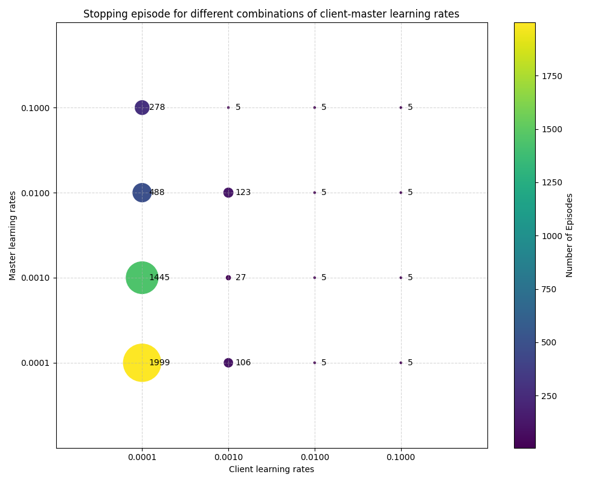

# Gradient Asymmetry and Activation Saturation in Actor-Critic Networks

[](paper/main.pdf)
[]()
[](LICENSE)

> **Ongoing Research**: Results and discussions are preliminary and subject to change.

> **Continuation of [CCM_MADRL_MEC](https://github.com/TesfayZ/CCM_MADRL_MEC)** — analyzing gradient asymmetry and activation saturation observed in that work.

## Motivation

During PhD research on the [CCM-MADRL algorithm](https://doi.org/10.1145/3768579) for mobile edge computing, we observed that **actor networks stopped updating their weights early in training** while critic networks continued learning. In the [original thesis experiments](https://eprints.soton.ac.uk/491435/) (Chapter 5, different seed and environment setting), **only 1 out of 16 learning rate combinations converged** across 10 runs with 95% confidence intervals — 93.75% of configurations failed because actors stopped updating entirely due to activation saturation.


*Stopping episodes from thesis experiments (different seed/environment from current work). Darker = earlier stopping. Only the bottom-left corner allowed training to complete.*

## Key Finding

| Component | Output Activation | Gradient Behavior | Stops? |
|-----------|------------------|-------------------|--------|
| **Actor** | tanh (bounded) | Vanishes when saturated | Yes |
| **Critic** | linear (unbounded) | Always flows | No |

High actor learning rates (0.01–0.1) cause tanh saturation within 161–247 episodes. Conservative rates (0.0001) maintain gradient flow throughout 2000 episodes. We measure a **4–8 order of magnitude** gradient asymmetry between actors and critics.

## Repository Structure

```
gradient_asymmetry/
├── paper/                          # LaTeX paper
│   ├── main.tex / main.pdf
│   ├── sections/                   # intro, background, methodology, analysis, discussion, conclusion
│   └── figures/
│
└── ColabExperiments/               # Google Colab experiments
    ├── original_experiment/        # Baseline (seed=42, all 16 LR configs)
    ├── large_actor_experiment/     # 512→128 actor (28× more params)
    ├── layernorm_experiment/       # LayerNorm before tanh output
    ├── linear_activation_experiment/ # Linear hidden activations
    ├── gradient_clipping_experiment/ # Gradient clipping (max_norm=1.0)
    ├── fullnorm_experiment/        # Full normalization (cancelled)
    └── plot_*.py, figures/         # Analysis scripts and plots
```

## Mitigation Experiments

**Key insight:** Preventing early stopping sometimes improves convergence, but not always. InputNorm eliminates all detected stopping (16/16) yet worsens reward in 13/16 configurations. Convergence rate (configs with improved reward) — not stopping rate — is the true measure of effectiveness.

| Experiment | No-Stop | Reward Improved | Best Reward | Verdict |
|------------|---------|-----------------|-------------|---------|
| **Baseline** | 6/16 | — | -29,325 | — |
| **Large Actor** (512→128) | 3/16 | 1/16 | -29,363 | **Counterproductive** — larger network accelerates saturation |
| **Gradient Clipping** (norm=1.0) | 8/16 | 4/16 | -29,399 | Partially effective — helps critic-LR=0.1 only |
| **LayerNorm** | 13/16 | 8/16 | -26,094 | Mixed — best single reward but degrades low-LR configs |
| **InputNorm** | 16/16* | 3/16 | -33,978 | **Misleading** — stops detection artifact; 13/16 worse reward |
| **Adaptive Scaling** | 12/16 | 9/16 | -30,576 | **Most effective** by convergence criterion |
| **Linear Activations** | — | — | — | Failed — pre-activation explosion 17× worse |
| **Full Normalization** | — | — | — | Cancelled — training prohibitively slow |

*\*Detection artifact; running statistics mask stopping detection (see paper).*

## Reproducibility

All current experiments use **seed=42** (PyTorch, NumPy, Python random, CUDA, environment) with a GPU-optimized implementation and updated MEC environment scaling. An earlier unseeded run showed the same structural patterns (identical stopping behavior) but with higher reward variance. The thesis experiments (1/16 convergence rate) used a different seed and environment configuration with 10 runs per setting; current single-run experiments identify the saturation mechanism rather than establish convergence statistics.

## Quick Start

```bash
git clone https://github.com/TesfayZ/gradient_asymetry_AND_activation_saturation.git
cd gradient_asymetry_AND_activation_saturation
pip install -r requirements.txt
```

**Run experiments** — upload zip files from experiment directories to Google Colab. Each contains a Jupyter notebook.

**Compile paper:**
```bash
cd paper && pdflatex main.tex && bibtex main && pdflatex main.tex && pdflatex main.tex
```

## Citation

```bibtex
@article{gradient_asymmetry2025,
  title={Gradient Asymmetry and Activation Saturation in Actor-Critic Networks},
  author={Gebrekidan, Tesfay Zemuy and others},
  year={2025}
}
```

**Related:** [CCM-MADRL](https://doi.org/10.1145/3768579) (Gebrekidan, Stein, Norman — ACM TAAS 2025)

## License

MIT License — see [LICENSE](LICENSE) for details.
